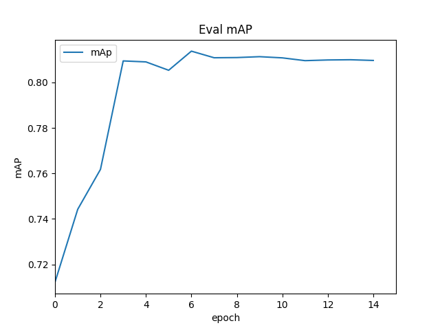

# Inverted Attention with Faster R-CNN

### This is an pytorch implementation of the WACV'2020 paper ['Improving Object Detection with Inverted Attention'](https://openaccess.thecvf.com/content_WACV_2020/papers/Huang_Improving_Object_Detection_with_Inverted_Attention_WACV_2020_paper.pdf).


### Step 1: Installation
Create a conda environment and install dependencies:
```bash
conda create -y -n torch113 python=3.8
conda activate torch113
pip install torch==1.13.0+cu117 torchvision==0.14.0+cu117 torchaudio==0.13.0 --extra-index-url https://download.pytorch.org/whl/cu117
pip install -r requirements.txt

```

### Step 2: Download Dataset
We use Pascal VOC2012 train/val dataset
```bash
wget http://host.robots.ox.ac.uk/pascal/VOC/voc2012/VOCtrainval_11-May-2012.tar
tar -xvf OCtrainval_11-May-2012.tar
```


### Step 3: Train the model
Set the dataset path "--data-path" of VOCdevkit in the 'train_res50_fpn.py'
```bash
python train_res50_fpn.py
```

### Step 4: Evualate the model

```bash
python validation.py 
```


### Step 5: Visulize the feature map
Change the model path in the "Object_CAM_IAN.ipynb" under visualization file, and you will obtain the attention map like this:


## Acknowledgement
This repo benefits from [faster_rcnn](https://github.com/WZMIAOMIAO/deep-learning-for-image-processing/tree/master/pytorch_object_detection/faster_rcnn),and [Pytorch-Inverted-Attention](https://github.com/zichengsaber/Pytorch-Inverted-Attention/tree/main). Thanks for their works.